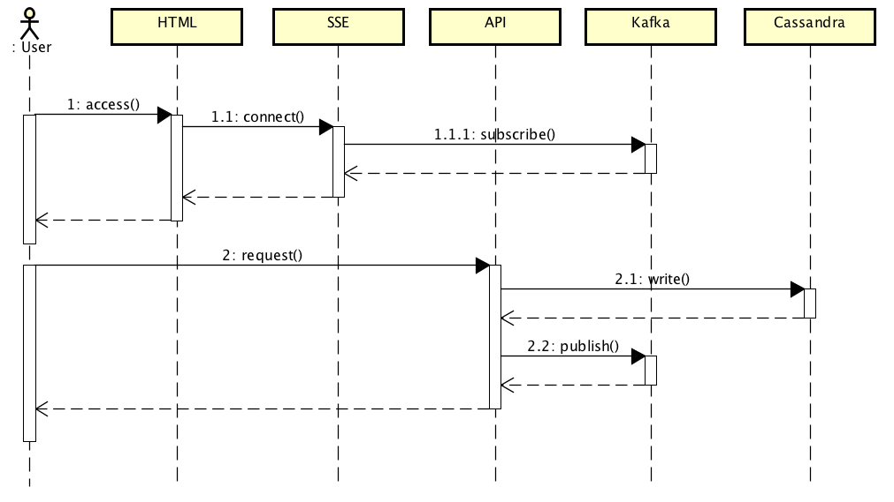

## Stream wih Spring Boot Reactive + Kafka + Server Sent Event + Cassandra.


HTTP stream using Server Sent Event and Kafka, implemented with Spring Boot Reactive and Reactor Kafka. As a plus the data was storage in Cassandra using Spring Data. 

1. the user connects to the service of SSE (Server Sent Event) via Javascript (EventSource) to listen the events (from kafka).
2. the user interacts with the service sending HTTP requests and generating events (to kafka) and stored in Cassanda.



Quick start. 

```
git clone https://github.com/renatoaguimaraes/spring-reactive-kafka-sse.git spring-reactive-kafka-sse
cd ./spring-reactive-kafka-sse 
```

Starting Cassandra, Zookeeper and Kafka with docker-compose.

```
docker-compose up
```

Accessing the Cassandra console to create the keyspace.

```
 docker exec -it some-cassandra bash
```

Execute cqlsh console inside the container.

```
cqlsh
```

Create the keyspace 'poc'.

```
CREATE KEYSPACE poc WITH REPLICATION = {'class': 'SimpleStrategy', 'replication_factor': 1};
```

Star application 

```
./gradlew build && java -jar build/libs/gs-reactive-rest-service-0.1.0.jar 
```


